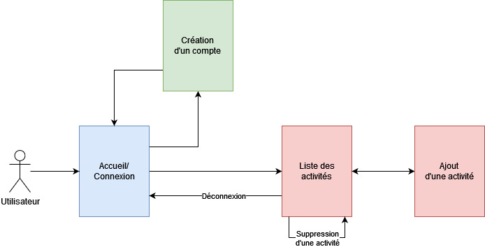

## Programmation web avancée
# Épreuve-synthèse pratique (35 points)

Le mandat de cet exercice est de créer un site web qui affiche une liste d’activités: un exemple d'activités serait d'aller se promener en nature, de visiter le musée, d'aller à la taverne, etc.  
- Une activité a un nom, une image facultative, une catégorie obligatoire et une date de création.  
- Une catégorie a un nom.
   
 

L’utilisateur peut se connecter dans une page de connexion pour accéder à la page d'administration lui permettant de consulter, d’ajouter et de supprimer des activités dans la liste.  
- Les utilisateurs ne peuvent consulter ou supprimer que les activités qu'ils ont ajoutés eux-mêmes et qui leur appartiennent.
- Un utilisateur a un nom, un prénom, un courriel, un mot de passe et une date de création du compte.  
  
 

**L’ensemble du projet doit obligatoirement être réalisé à l’aide du cadriciel MVC orientée-objet créé au cours des cours précédents.** 
  
> *Assurez-vous d’inclure votre base de données avec la remise!*

  

---

## Liste des pages

### Accueil/Connexion
>1. Formulaire de connexion avec courriel et mot de passe
>1. Lors d'une erreur de connexion, un message approprié doit être affiché dans la page
>1. Lors d'une connexion réussie, on redirige à la page d'administration qui affiche la liste des activités
>1. Lien vers le formulaire de création d'un compte

 

### Création d'un compte
>1. Formulaire de création d'un compte où les informations nécessaires sont récupérées
>1. Lors d'une erreur, un message approprié doit être affiché dans la page
>1. Lors d'une création de compte réussie, on redirige au formulaire de connexion de la page d'accueil

 

### Administration
>1. Affichage de la liste des activités *associées* à l'utilisateur avec nom, photo et catégorie
>1. Inclure un bouton de déconnexion: la déconnexion est suivie d'une redirection à l'accueil
>1. Inclure un bouton de suppression pour chaque activité
>1. Lien vers l'ajout d'une activité

 

### Ajout d'activités
>1. Formulaire d'ajout d'une activité avec nom, image facultative et catégorie
>1. Lien de retour à la page d'administration

 

## Exigences spécifiques et mentions
>- Le projet doit être remis dans une archive .zip nommée **pwa_es_NOM_prenom.zip**, contenant le code du projet et le script .sql de la BDD
>- Les routes des pages d'administration (liste, ajout, suppression) doivent être **protégées**: on ne peut pas y accéder sans être connecté, par exemple en entrant l'URL à la main dans la barre d'adresse
>- Les routes qui servent à traiter un formulaire doivent aussi être "protégées": on ne peut pas y accéder sans la soumission d'un formulaire
>- Le mot de passe de l'utilisateur doit être **encrypté**
>- Le style visuel vaut 2 points (CSS, Sass, Bootstrap et/ou Tailwind permis)  

>- Vous n'avez **pas** à implémenter la *modification* d'une activité

---

## Schéma général

 

 

---

## Critères d'évaluation

 

 Critères | Pondération 
 :------ | :----------: 
Base de données: structure et relations | 3 
Modèle(s) approprié(s) | 2
Liste des routes | 1
Structure des controllers et de ses méthodes | 2
Accueil/connexion | 4
Création d'un compte | 4
Administration/liste des activités | 4
Suppression d'une activité | 2
Ajout d'une activité | 3
Style visuel | 2
Qualité du code (PHP, HTML) et documentation des méthodes | 8
**Total** | **35**